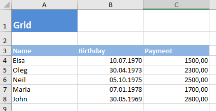

# Grid

The jx:grid command is useful for generating a dynamic grid with a header area and a data rows area.

```
jx:grid(headers="headers" data="items" areas=["A3:A3","A4:A4"] formatCells="BigDecimal:C1,Date:D1" lastCell="A4")
```


So you see the jx:grid need only a `${header}` and a `${cell}`.



`headers`: expression where the result can be an array or an Iterable. Result null would create a grid with 0 columns.
The array/Iterable item will be put as a value to the data map using the var name "header". It's usually a String. See example 4.

`data`: expression where the result can be an array or an Iterable. Result null would create a grid with 0 rows.
The array/Iterable item is an array, Iterable or an object. If it's an object you have also to specify `props`. Otherwise
the values of the array/Iterable will be output column by column using the `cell` var. See examples 1 to 3.

`props`: non-empty comma-separated list of object property names. Only needed if the data items aren't an array or an Iterable.
Whitespace is allowed.
See example 3.

`formatCells`: comma-separated list of a type to cell mapping. Type is the short class name of the expression result,
cell is a cell reference like B2, separated by a colon. Example: Double:B4,Date:C4 <br/>
Whitespace is allowed.

`areas`: used for specifying the header cell area and the data rows cell area. Note that `areas=["A3","A4"]` would not be valid.

`lastCell`: area end

## Example 1: adding employees as Iterables to the data map

`props` is not needed.

```
List<List<Object>> items = new ArrayList<>();
for (Employee employee : employees) {
    List<Object> item = new ArrayList<>();
    item.add(employee.getName());
    item.add(employee.getBirthDate());
    item.add(employee.getPayment());
    gridData.add(item);
}
data.put("items", items);
```

Use this approach if you want very flexible source code.

## Example 2: adding employees as arrays to the data map

`props` is not needed.

```
List<Object[]> items = new ArrayList<>();
for (Employee employee : employees) {
    Object[] item = new Object[] {
        employee.getName(),
        employee.getBirthDate(),
        employee.getPayment() };
    gridData.add(item);
}
data.put("items", items);
```

Use this approach if you already have arrays.

## Example 3: adding employees as objects to the data map

`props="name, birthDate, payment"` must be specified in the jx:grid command.

```
data.put("items", employees);
```

Use this approach if you want to be very flexible in the template.

## Example 4: adding headers to the data map

```
data.put("headers", Arrays.asList("Name", "Birthday", "Payment"));
```
