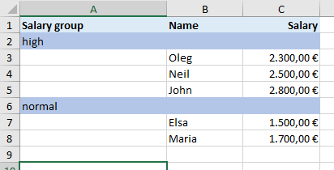
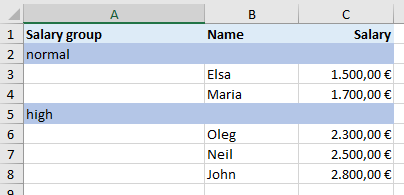
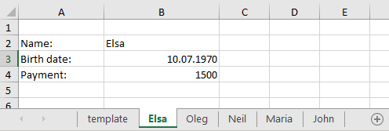
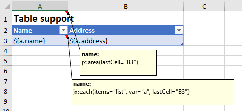
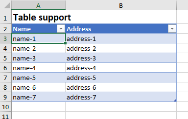

# Each

The jx:each command is primarily for creating rows. (More abilities are described later on this page.)

```
jx:each(items="employees" var="e" lastCell="C2")
```


```
Map<String, Object> data = new HashMap<>();
data.put("employees", .../*List of Employee objects*/);
JxlsPoiTemplateFillerBuilder.newInstance().withTemplate(template)
    .buildAndFill(data, new File(outputFilename));
```


`items`: expression that returns an Iterable or an array

`var`: variable name that holds the object for each row

`lastCell`: area end

## direction

Default is direction="DOWN" and rows will be created. Using direction="RIGHT" columns will be created.

You can also set your own cellRefGenerator for special cases instead, but this is not described further.

```
jx:each(items="e.departments" var="d" lastCell="D2" direction="RIGHT")
```

In the template the employees list uses direction="DOWN" by default and e.departments uses direction="RIGHT".


## varIndex

Use attribute varIndex for specifing a variable name that will hold the 0 based iteration index.

```
jx:each(items="employees" var="e" varIndex="index" lastCell="C2")
```


## orderBy

The orderBy attribute holds a list of property names for sorting the items.
You should prepend the var name + "." before each property name.
Append " DESC" to a single property name for reversing the sort order. " ASC" is the default.

Use DESC_ignoreCase or ASC_ignoreCase for ignoring case. The values must be Strings.

```
jx:each(items="employees" var="e" orderBy="e.name, e.payment DESC" lastCell="C2")
```

name is the first sorting criterion (ASC), payment is the second sorting criterion (DESC).


You should prefer sorting the items with your Java code. Use orderBy if you don't want to change your codebase.

## select

Only items where the select condition will be true will be part of the output. Prepend var name + "." to property names.

```
jx:each(items="employees" var="e" select="e.payment > 2000" lastCell="C2")
```


jx:each with select is like jx:each + jx:if.

## groupBy, groupOrder

Specify var name + "." + property name in attribute `groupBy` for grouping the items.
You *must* also specify ASC, DESC, ASC_ignoreCase or DESC_ignoreCase in attribute `groupOrder`. You can only use ASC_ignoreCase
and DESC_ignoreCase if the group key is a String.

Access the group key using var name + ".item." + group key property name. Access the grouped items using var name + ".items".

```
jx:each(items="employees" var="g" groupBy="g.salaryGroup" groupOrder="ASC" lastCell="C3")
```




Here's an example with groupOrder="DESC". In this example you can also see that the var attribute is omitted.
Then Jxls uses "_group" as var name.

```
jx:each(items="employees" groupBy="salaryGroup" groupOrder="DESC" lastCell="C3")
```




## Combination of select and groupBy+groupOrder

You can combine the use of select and groupBy+groupOrder. The select filtering will be done *before* the grouping.

However, if you specify `oldSelectBehavior="true"` the select filtering will be done *after* the grouping
(which was the default behavior in version 2.12.0 and before). Try to avoid the use of `oldSelectBehavior="true"` because
this feature could be removed in a future version.

```
jx:each(items="employees" var="g" select="g.payment<2500" groupBy="salaryGroup" groupOrder="ASC" lastCell="C3")
```


## multisheet

Use the multisheet attribute for creating multiple sheets dynamically. The multisheet expression returns a String list of sheet names.
The (sheetNames) list must have as many entries as there are (employees) items. The number of sheets is controlled by the items attribute.

```
data.put("sheetNames", employees.stream().map(employee -> employee.getName()).toList());
```

```
jx:each(items="employees" var="e" multisheet="sheetNames" lastCell="B4")
```




In the above example `JxlsPoiTemplateFillerBuilder.newInstance().withKeepTemplateSheet(KeepTemplateSheet.KEEP)` is used to keep the
template sheet. Use `HIDE` to hide the template sheet. The default `DELETE` deletes the template sheet. 

Use the following code to ensure valid and unique sheet names:

```
data.put(SafeSheetNameBuilder.CONTEXT_VAR_NAME, new PoiSafeSheetNameBuilder());
```

You can use your own implementation using the SafeSheetNameBuilder interface.
If the number of sheetNames and items do not match see example code in PoiSafeSheetNameBuilderUnitTest.testNotEnoughSheetNames()
for modifying PoiSafeSheetNameBuilder.

Instead of returning a String list the multisheet attribute can also rely on the iteration object and holds an expression for getting
the sheet name.
<br/>Implementation details: This works only if no cellRefGenerator has been specified.
EachCommand uses DynamicSheetNameGenerator for this. A specified SafeSheetNameBuilder (see above) will also be used.

```
jx:each(items="employees" var="e" multisheet="e.name" lastCell="B4")
```

e.name will call Employee#getName()


## Table support

jx:each (only with direction=DOWN) supports tables. The table height will be automatically adjusted.




